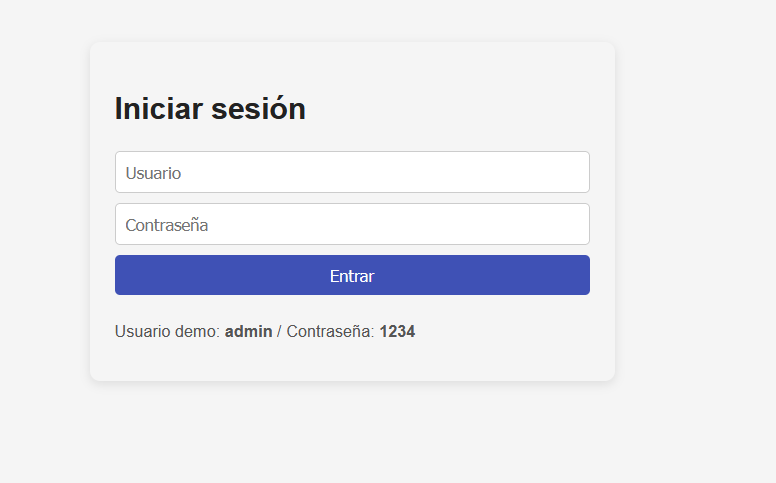
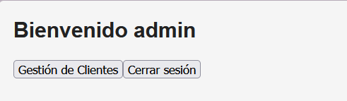
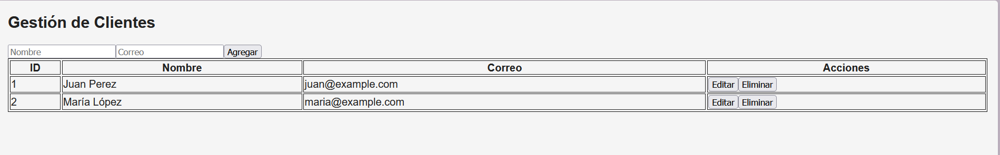
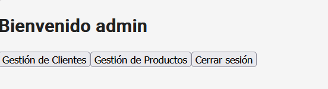
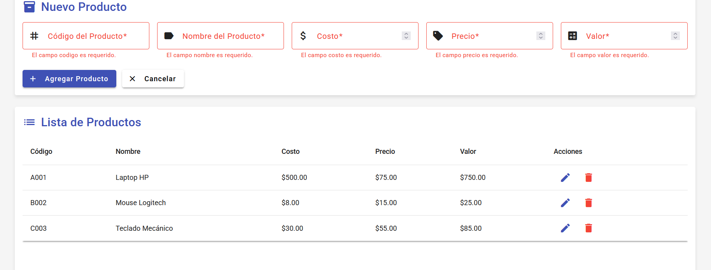

# SPA Lab - Sistema de Gestión con Angular 17 + Material

Proyecto Angular completo con sistema de autenticación, gestión de clientes y **gestión de productos con validaciones personalizadas**.

## 🚀 Características

- ✅ Sistema de autenticación con guards
- ✅ Dashboard con navegación
- ✅ Gestión de clientes
- ✅ **Gestión de productos con validaciones personalizadas**
- ✅ Angular Material UI
- ✅ Formularios reactivos
- ✅ Persistencia en localStorage

## 📦 Instalación

1. **Instalar dependencias:**

   ```bash
   npm install
   ```

2. **Ejecutar el servidor de desarrollo:**

   ```bash
   npm start
   # o
   npx ng serve --open
   ```

3. **Abrir en el navegador:**
   - URL: `http://localhost:4200`
   - Usuario: `admin`
   - Contraseña: `1234`

## 🎯 Módulo de Productos

### Campos del formulario:

- **Código del producto**: Debe iniciar con letra seguida de números (ej: A001)
- **Nombre**: Mínimo 5 caracteres
- **Costo**: Debe ser mayor a 0
- **Precio**: Rango entre 10 y 100
- **Valor**: Número flotante

### Validaciones implementadas:

#### 1. Precio (10-100)

- **Mensaje de error**: "El precio está fuera de rango."

#### 2. Código del producto

- **Formato**: Letra seguida de números (ej: A001)
- **Mensaje de error**: "El código debe iniciar con una letra seguida de números (ej: A001)."

#### 3. Nombre del producto

- **Validación**: No nulo, mínimo 5 caracteres
- **Mensaje de error**: "El nombre del producto debe tener mínimo 5 caracteres."

#### 4. Costo

- **Validación**: Mayor a 0
- **Mensaje de error**: "Ingrese un costo válido."

## 📂 Estructura del Proyecto

```
src/
├── app/
│   ├── login/              # Componente de login
│   ├── dashboard/          # Dashboard principal
│   ├── clientes/           # Gestión de clientes
│   ├── productos/          # ⭐ Gestión de productos
│   ├── models/             # Modelos de datos
│   ├── services/           # Servicios (auth, cliente, producto)
│   ├── guards/             # Guards de autenticación
│   ├── validators/         # ⭐ Validadores personalizados
│   ├── app-routing.module.ts
│   └── app.module.ts
├── environments/
├── index.html
├── main.ts
└── styles.css
```

## 🎨 Tecnologías

- **Angular 17**
- **Angular Material** (UI Components)
- **TypeScript**
- **RxJS**
- **Formularios Reactivos**

## 🔐 Credenciales de prueba

- **Usuario**: admin
- **Contraseña**: 1234

## 📝 Comandos útiles

```bash
# Servidor de desarrollo
npm start

# Build de producción
npm run build

# Tests
npm test
```

## 💡 Notas

- Los datos se almacenan en **localStorage**
- Las validaciones son en **tiempo real**
- Interfaz moderna con **Angular Material**
- Diseño responsive

## Capturas de la funcionalidad

# Taller 1

### Iniciar sesión



### Menú



### Gestión de clientes



# Taller 2

### Menu



### Gestion de productos



